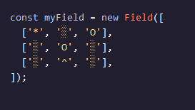

# Project Premise
> In this project, you’ll be building an interactive terminal game. The scenario is that the player has lost their hat in a field full of holes, and they must navigate back to it without falling down one of the holes or stepping outside of the field.

## Project Requirements
-  Your project is centered on a Field class. This and the following tasks will describe how the class should function at a high level, and it will be up to you to figure out the implementation in code. As you go, test your code by creating instances of the class and calling its methods.   
The Field constructor should take a two-dimensional array representing the “field” itself. A field consists of a grid containing “holes” (O) and one “hat” (^). We use a neutral background character (░) to indicate the rest of the field itself. The player will begin in the upper-left of the field, and the player’s path is represented by *.  
      
Your class should take a single argument representing the field:  
     
 

- Give your Field class a .print() method that prints the current state of the field. You can choose to format this however you want, but it will be much easier to play the game if you print out a string representation of the board instead of the raw array.

 

- ##### Your game should be playable by users. In order to facilitate this, build out the following behavior:

    - When a user runs main.js, they should be prompted for input and be able to indicate which direction they’d like to “move”.
    - After entering an instruction, the user should see a printed result of their current field map with the tiles they have visited marked with *. They should be prompted for their next move.

    ##### This should continue until the user either:

        - Wins by finding their hat.
        - Loses by landing on (and falling in) a hole.
        - Attempts to move “outside” the field.

    ##### When any of the above occur, let the user know and end the game.
 

- Add a .generateField() method to your Field class. This doesn’t need to be tied to a particular instance, so make it a static method of the class itself.
 
This method should at least take arguments for height and width of the field, and it should return a randomized two-dimensional array representing the field with a hat and one or more holes. In our solution, we added a third percentage argument used to determine what percent of the field should be covered in holes.
 
