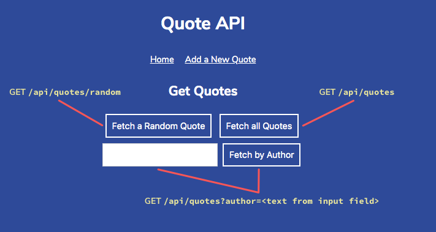
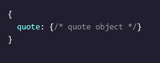
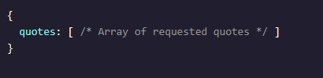
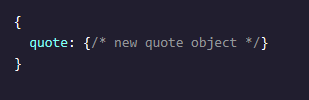

# Project Premise
> In this project, you’ll be building a small Express.js web API to store and serve different quotes about computers, coding, and technology.

## Project Requirements
-  You’ve been given some starter code in the form of a front-end site and some Express.js boilerplate. You’ll use this to build several route handlers to serve up interesting quotes. In server.js, you've been provided with some imported helper functions and data:

    - A quotes array with some pre-populated quotes about technology. Each quote in the array has a person and quote property. You can use our array or write your own, but make sure to have at least the person and quote properties, as the front-end that we’ve provided expects each quote to have them.
 
    - The getRandomElement() function, which takes an array and returns a random element from that array.

- Set your server to listen on the PORT variable.
    - Once you start up the server with node server.js, navigate to localhost:4001 in the browser. You’ll know things are up and running when you load the blue Quote API site in the browser.
 
    - This diagram explains how the front-end buttons correspond to different request routes.

 

- Your API should have a GET /api/quotes/random route. This route should send back a random quote from the quotes data. The response body should have the following shape:

 
- Your API should have a GET /api/quotes route. This route should return all quotes from the data if the request has no query params.
    - If there is a query string with a person attribute, the route should return all quotes said by the same person. For instance, the data set has multiple quotes for Grace Hopper, so GET /api/quotes?person=Grace Hopper should return an array of only those quotes. If there are no quotes for the requested person, send back an empty array.

    - The response body should have the following shape for all GET /api/quotes requests:

 
- Your API should have a POST /api/quotes route for adding new quotes to the data. New quotes will be passed in a query string with two properties: quote with the quote text itself, and person with the person who is credited with saying the quote.
 
    This route should verify that both properties exist in the request query string and send a 400 response if it does not. If all is well, this route handler should add the new quote object to the data array and send back a response with the following shape:
    

## Project Extension Ideas

- Add a PUT route for updating quotes in the data. This might require adding some sort of unique ID for each quote in the array in data.js.

- Add a DELETE route for deleting quotes from the data array. As with PUT, this might require adding IDs to the data array and using req.params. For both of these ideas, you’ll be able to interact via Postman.

- Add other data to the array, such as the year of each quote, and try to display it on the front-end.

- Add another resource to your API in addition to quotes, such as biographical blurbs (you’ll need to find your own data for this new resource). Use Express Routers to keep your code simple and separated into different files for each router.

For most of these ideas, you might need to look into the front-end code in the public/ folder. If you’re not as familiar with front-end JavaScript, try our Build Interactive JavaScript Websites course and the Requests section of our Introduction to JavaScript course.