# Project Premise
> In this project, you will create an entire API to serve information to a Boss Machine, a unique management application for today’s most accomplished (evil) entrepreneurs. You will create routes to manage your ‘minions’, your brilliant ‘million dollar ideas’, and to handle all the annoying meetings that keep getting added to your busy schedule.

## Project Requirements
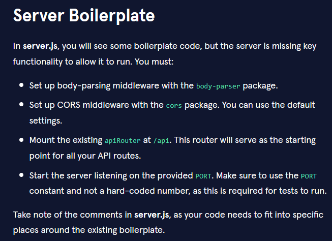
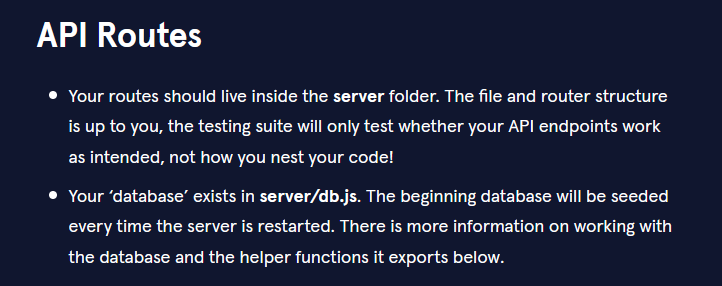 
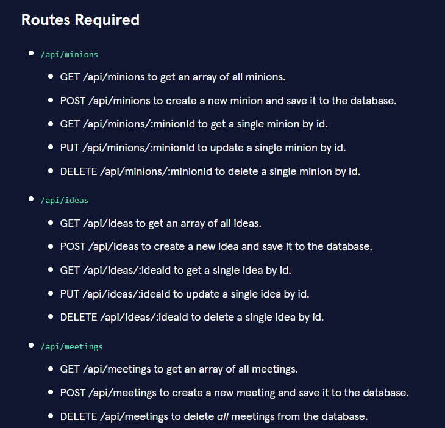 
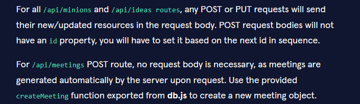
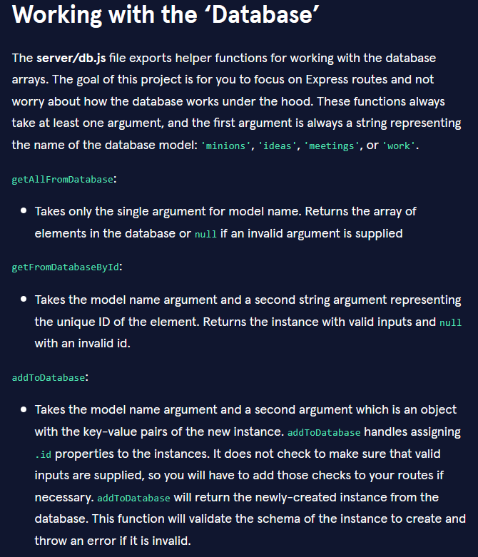
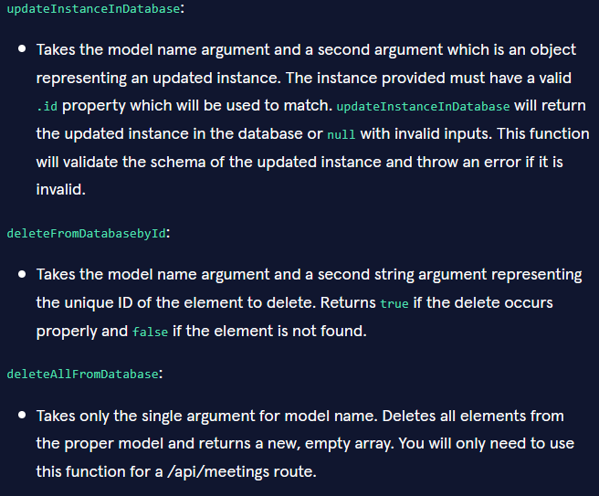
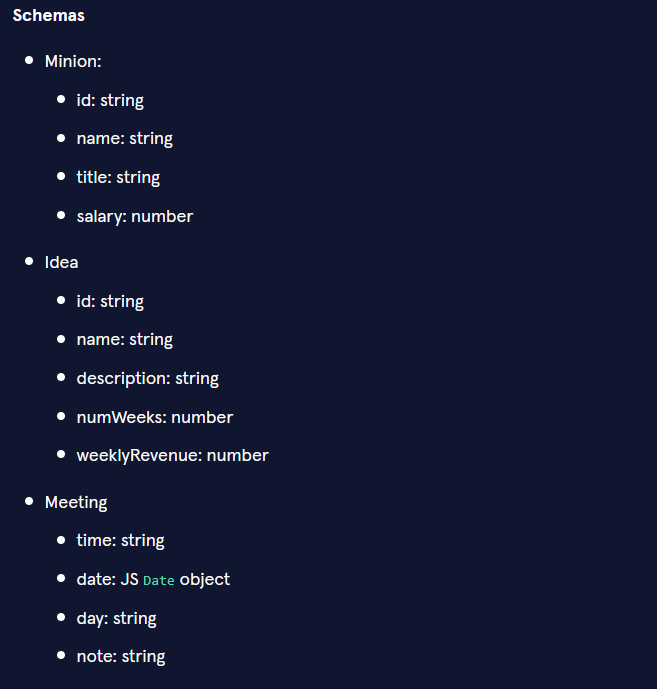
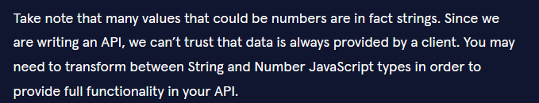
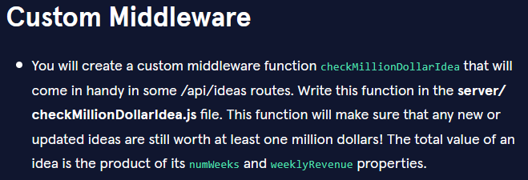
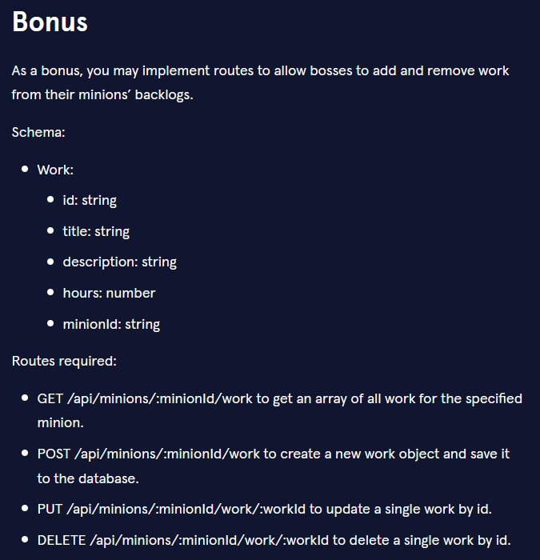
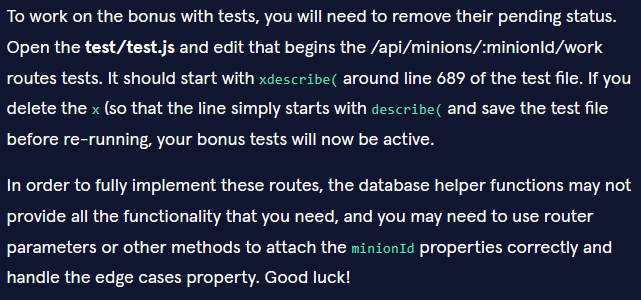